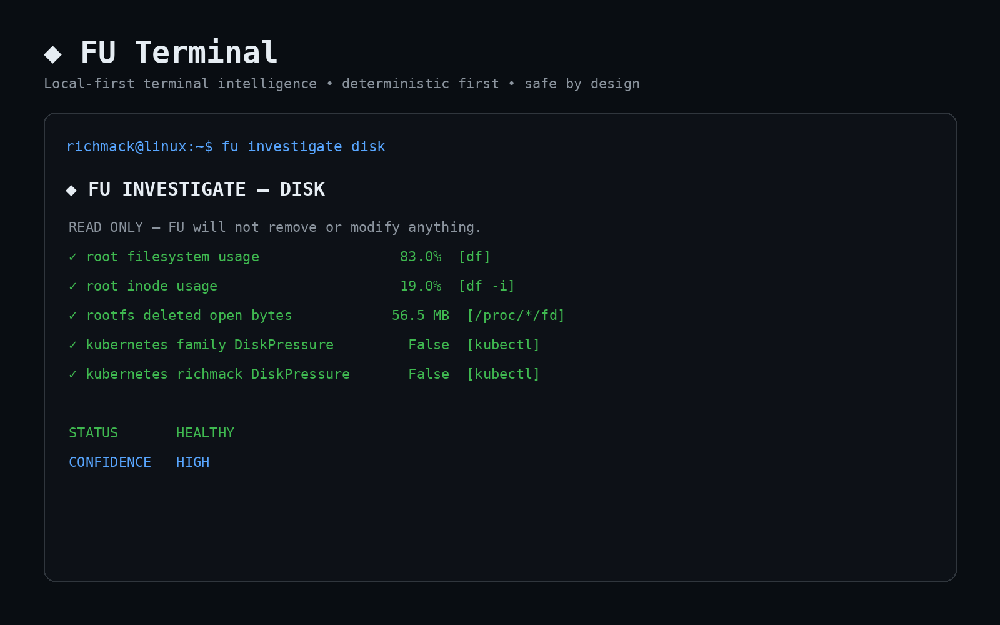
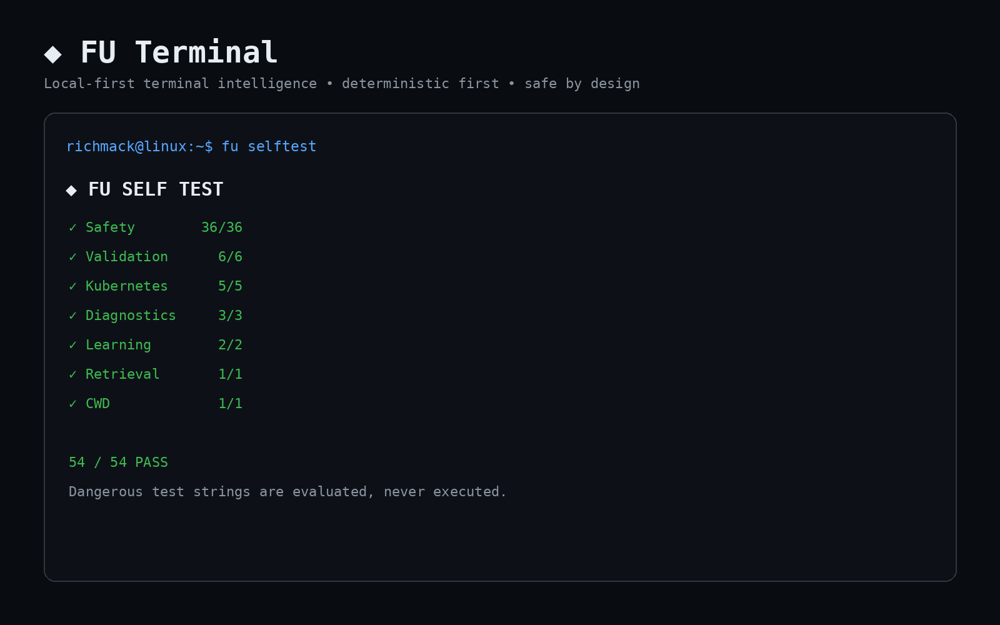
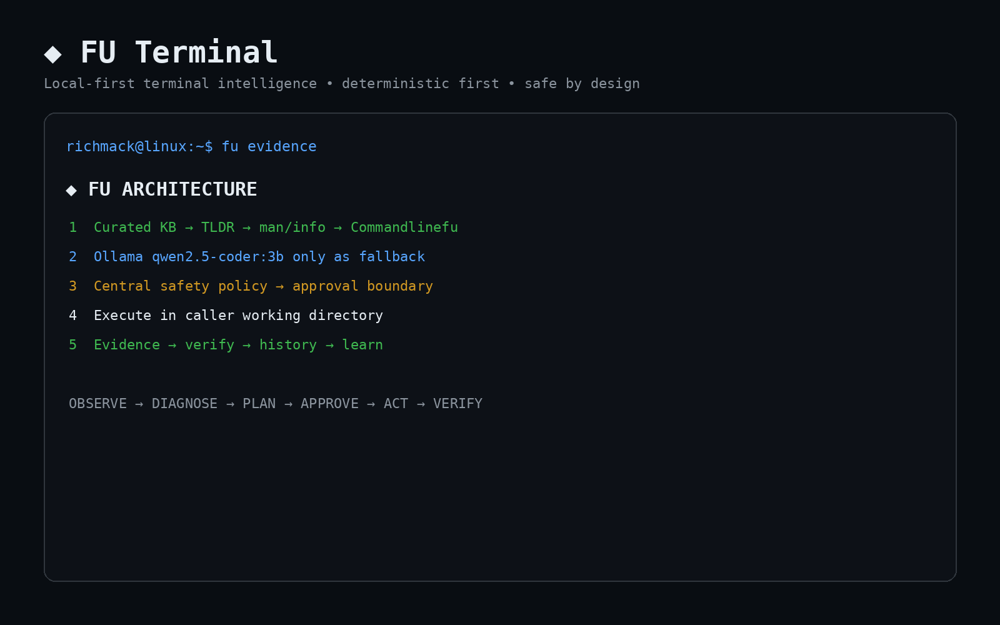

# FU Terminal

[](https://github.com/iamrichmack111/fu-terminal/actions/workflows/ci.yml)
[](https://github.com/iamrichmack111/fu-terminal/actions/workflows/container.yml)
[](https://github.com/iamrichmack111/fu-terminal/releases)
[](LICENSE)
[](fu_selftest.py)
[](https://ollama.com/)

**FU Terminal is a local-first terminal intelligence, safety, diagnostics, verification, and learning engine.** It resolves common requests from deterministic local knowledge first and uses a local Ollama model only as fallback.



## Why FU is different

FU is not designed around “ask an LLM and execute whatever it says.” Its path is **curated KB → TLDR → man/info → Commandlinefu → Ollama fallback → safety policy → approval → execution → verification → history/learning**. Dangerous model-generated commands are blocked, curated destructive operations require explicit approval, and only deterministic read-only rules explicitly marked for auto execution can use `--auto`.

## Install

```bash
unzip fu-terminal-v1.0.0.zip
cd fu-terminal-v1.0.0
./install.sh
```

The installer creates an isolated Python environment, installs the `fu` launcher and man page, creates the FU workspace, detects/installs Ollama when needed, and pulls **`qwen2.5-coder:3b`** as FU's default fallback model. Override with `FU_MODEL=... ./install.sh`.

```bash
fu --auto "disk usage"
fu investigate disk
fu evidence
fu verify last
fu incident last
fu why-last
fu learn kubectl
fu selftest
man fu
```

## Safety model



The safety engine is a pure policy function shared by runtime execution and regression tests. The current suite reports **54/54 passing checks**, including destructive-command recognition, model hard blocks, curated destructive approval, auto-mode boundaries, shell syntax, placeholders, Kubernetes current-vs-historical state, diagnostics, retrieval, learning, and caller-CWD preservation.

## Evidence-backed diagnostics

`fu investigate disk` is read-only. It combines current filesystem usage, inode pressure, root-filesystem deleted-open bytes, and Kubernetes DiskPressure. Deleted `memfd`/tmpfs objects are excluded from root-disk accounting. FU reports both a status and confidence rather than treating old events as current conditions.

## Verification and history

A command exiting zero is not treated as proof that the user's goal was achieved. `fu verify last` independently checks supported goals. `fu history` stores structured execution records, while `fu incident last` attaches verification only when immutable execution fields match.

## Local learning

`fu learn`, `fu why`, and `fu why-last` teach from local sources. FU can explain nested commands such as `sudo` and `xargs`, use TLDR/man/info, and surface stored examples without needing the fallback model.

## Architecture



The editable architecture source is [`docs/architecture/fu-terminal.d2`](docs/architecture/fu-terminal.d2). Render it with:

```bash
d2 docs/architecture/fu-terminal.d2 docs/architecture/fu-terminal.svg
```

## Detailed narrated feature demo

The release includes [`media/fu-terminal-feature-demo.mp4`](media/fu-terminal-feature-demo.mp4), a narrated feature-tour preview. The reproducible production pipeline is in `scripts/render-demo.sh`: **Playwright** captures the feature screens, then **Piper** with the `en_US-ryan-high` voice generates higher-quality local narration and FFmpeg renders the final MP4. The Piper voice is downloaded automatically on first render.

## Container

```bash
docker build -t fu-terminal:1.0.0 .
docker run --rm fu-terminal:1.0.0 selftest
```

The container is useful for CI, regression testing, documentation, and isolated FU operation. Host administration requires explicitly mounting/exposing the resources FU needs; the image does not silently grant host privileges. Tagged releases publish to GHCR through GitHub Actions.

## CI/CD

GitHub Actions compile and test Python on pushes and pull requests. Version tags create release ZIP artifacts and publish the container to GHCR. The workflows are under `.github/workflows/`.

## Repository topics

Run `./scripts/set-github-topics.sh iamrichmack111/fu-terminal` after creating the repository. It adds terminal, Linux, DevOps, local-AI, Ollama, Kubernetes, shell, automation, Python, and developer-tool topics.

## Development

```bash
python3 -m venv .venv
. .venv/bin/activate
pip install -r requirements.txt
python fu_selftest.py
```

FU executes commands in the directory where the user invoked `fu`, not in FU's installation directory. Runtime state is stored separately in `~/Desktop/FU-Workspace` by default.

## Release

See [`CHANGELOG.md`](CHANGELOG.md) and [`RELEASE_NOTES.md`](RELEASE_NOTES.md). `scripts/release.sh 1.0.0` pushes the version tag and creates the GitHub release when `gh` is authenticated.

## License

MIT.
